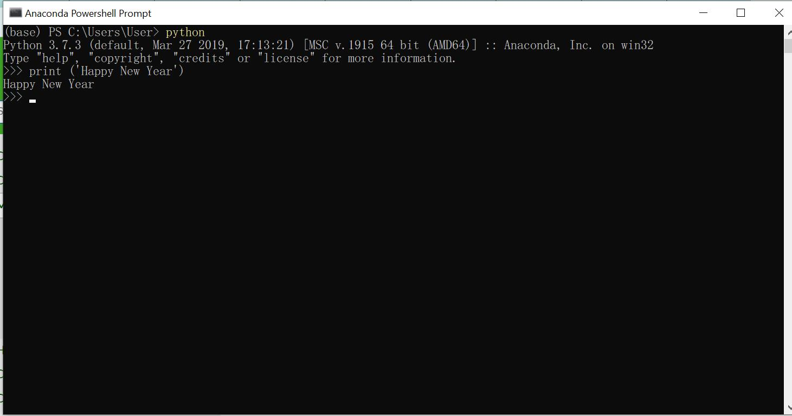

# 603021851-0 SI
นางสาวกมลวรรณ มีป้อง 603021851-0

# วิธีติดตั้ง miniconda
  1. search คำว่า miniconda บน google
  
  2. กดdownloadตามเวอร์คอมพิวเตอร์ที่ใช้
  
  3. กด Run เพื่อทำการติดตั้งโปรแกรมลงคอมพิวเตร์
  
  4. กด start ค้นหา minicanda หลังจากกดเลือกจะพบหน้าต่างดังกล่าว ให้พิมพ์ python จะขึ้นข้อมูลดังรูปเพื่อตรวจสอบว่าติดตั้งเสร็จแล้ว
  
  5. พิมพ์ print('') เพื่อทดสอบการใช้งาน ดังรูป
  
  6. ทำการติดตั้งแพคเก็ทที่จะใช้งานด้วยคำสั่ง  conda install jupyter ดังรูป
  
  7. ทำการติดตั้งแพคเก็ทที่จะใช้งานด้วยคำสั่ง  conda install matplotlib ดังรูป
  
  8. และปิดหน้าต่างโดยการพิมพ์ exit() 
  

# การใช้งานColab
  1. search คำว่า colabในgoogle ดังรูป
   
  2. กดเลือก Newpython3 notebook ด้านล่างหน้าต่าง ดังรูป
  
  3. กดเลือกไอคอนฟันเฟืองหากต้องการตั้งค่าลูกเล่นต่างๆๆดังรูป
   
  4. จากนั้นจะเด้งมาที่หน้าต่าง ดังรูป พิมพ์priny'' เพื่อทดลองใช้งาน
    

# การใช้งานGithub
  1. search คำว่า Github ใน google ดังรูป
   
  2. เมื่อทำการเข้าเว็บไซต์แล้วให้ทำการ login
   
  3. หลังจากlogin แล้วให้เข้ามาคัดลอกลิ้งตามรูปเพื่อcloneไปบนconda
  
  4. พิมพ์คำสั่ง git clone ตามด้วยลิ้งที่คัดลอกจากgithub ดังรูป
  
  5. ตรวจสอบไฟล์งานด้วยการพิมพ์ dir
  
   5.1ใช้คำสั่ง git status เพื่อตรวจสอบว่ามีไฟล์ขาดหาย
   5.2ใช้คำสั่ง git add สำหรับเพิ่มไฟล์ที่ต้องการ
   5.3ใช้คำสั่ง git commit -m'test git'เพื่อบอกว่ามีข้อมูลอะไรที่ต้องแสดงบนอินเทอร์เน็ต
   5.4ใช้คำสั่ง git push เพื่อนำไฟล์ข้อมูลไปแสดงบนอินเทอร์เน็ต
   

# การใช้งาน Visual Studio Code
  1. เข้าเว็บจากลิ้ง https://code.visualstudio.com/ แล้วกดDownload ดังรูป
  
  2. หลักจากDownloadเสร็จแล้วให้พิมพ์ code . ในconda ดังรูป
   
  3. หากสำเร็จจะเด้งมาหน้าต่างใหม่ ดังรูป
  
  4. จะพบไฟล์งานที่สร้างไว้(README.md)ให้กดเลือกไฟล์งานแล้วคลิก view จากtapด้านบน ดังรูป
  
  5. พิมพ์ Markเพื่อค้นหาMarkdown:Open preview to the side แล้วกดเลือก ดังรูป
  
   5.1 จะแสดงหน้าต่างดังรูป
   
   5.2 เลือกใช้คำสั่งสำหรับใช้งานโปรแกรมได้จากลิ้ง
   https://www.markdownguide.org/cheat-sheet/
    จะสามารถเริ่มต้นใช้งานได้
  

